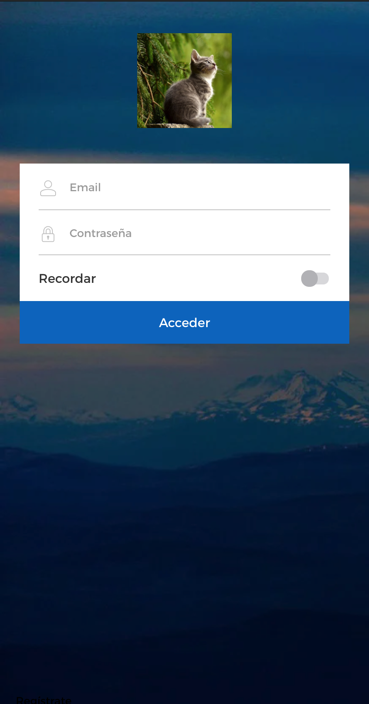

<br />
<div align="center">
    
    <h3 align="center">Ionic Login Example App</h3>
</div>

## Contenido
- [Sobre el proyecto](#sobre-el-proyecto)
- [Pila tecnológica](#pila-tecnológica)
- [Test](#test)
- [Ejecutar el proyecto](#ejecutar-el-proyecto)
- [Contacto](#contacto)

---
## Sobre el proyecto

<div align="center">
    
</div>

En este proyecto se ha implementado una aplicación sencilla, que consta de una pantalla de login, la cual esta maquetada a partir de la captura de pantalla disponible para dispositivos móviles. Esta pantalla cuenta con validacion y control de formularios mediante [Reactive Forms](https://angular.io/guide/reactive-forms) del Framework Angular. El proyecto contiene los siguientes ejemplos de desarrollo:

### Maquetación:
- [x] El proyecto ha sido maquetado a partir de una captura de pantalla usando para ello SCSS como preprocesador de CSS y HTML como lenguaje de marcado.
- [x] La maquetación cumple con el diseño responsive y tiene un breakpoint de 960px.
### Validación de formularios:
- Todos los campos de formulario de login seran validados con las siguientes reglas.
- [x] El campo de email no puede estar vacio.
- [x] El campo de email debe de coincidir con la expresión regular ``^([a-zA-Z0-9_\-\.]+)@([a-zA-Z0-9_\-\.]+)\.([a-zA-Z]{2,5})$``.
- [x] El campo password no puede estar vacio.
- [x] El campo password debe de tener una longitud minima de 5 caracteres.
- [x] El formulario cuenta con un switch para recordar los datos de usuario. El switch es de tipo booleano y opcional.
- [x] El botón de aceptar siempre esta activo, si el formulario contiene errores estos aparecen al pulsar el botón, en caso contrario se ejecuta la acción de login y muestra por pantalla los datos introducidos.
### Test:
- [x] Test unitarios.
- [ ] Test E2E.
- [x] Test de componentes.

[Ir arriba](#contenido)

---
## Pila tecnológica

Ionic es un framework que actua como wrapper para unir tecnologías que permiten la creación de aplicaciones multiplataforma, mediante el uso de tecnologías web. Por ello Ionic permite desarrollar aplicaciones para escritorio mediante [Electron](https://electronjs.org/), y para móviles mediante [Cordova](https://cordova.apache.org/) o [Capacitor](https://) y para web mediante [Angular](https://), [React]() o [Vue](). En este caso el proyecto esta orientado a tecnologías móviles, por lo que la pila tecnologica de este esta compuesta por los siguientes frameworks:

* [Ionic](https://nextjs.org/)
* [Angular](https://reactjs.org/)
* [Cordova](https://vuejs.org/)
* [Node](https://angular.io/)

[Ir arriba](#contenido)

---

## Test

El proyecto lleva implementado una serie de test en el framework [Jassmine](https://jasmine.github.io/). Para lanzar los test y comprobar que todo el proyecto funciona de forma correcta solo es necesario lanzar el siguiente comando:

```shell
ng test
```

---

## Documentación

El proyecto dispone de documentación generada y puede servirse mediante el comando:

```shell
npm run doc-serve
```

Esto lanzara un serviro web local con la dirección [http://127.0.0.1:8080](http://127.0.0.1:8080). Accediendo a este enlace podemos ver la documentación del proyecto.

---

## Ejecutar el proyecto

Para ejecutar este proyecto es necesario que el equipo cuente con las siguientes tecnologías instaladas:

- [Node.js](https://nodejs.org/es/)
- [Ionic-CLI](https://ionicframework.com/docs/cli/)

Una vez instaladas estas tecnologías, solo es necesario clonar este repositorio al equipo donde va a ejecutarse. Con un terminal ha de acceder al directorio raíz del proyecto y ejecutar el siguiente comando para instalar los paquetes necesarios:

```
npm install
```

Una vez los paquetes estan instalados es puede optar por ejecutar el proyecto mediante un navegador o mediante un dispositivo movil fisico o emulado. Para la ejecución mediante navegador solo es necesario que se ejecute el siguiente comando:

```
ionic serve
```

Para la ejecución en dispositivo fisico o emulado es necesario una configuración extra, así como la instalación de una aplicación de desarrollo para Android o iOS y la adecuada configuración del equipo, para mas información puede seguir este [enlace](https://ionicframework.com/docs/developing/android) para dispositivos Android y [este](https://ionicframework.com/docs/developing/ios) para dispositivos iOS.


---
## Contacto

Juan Antonio Contreras Fernández - juanantonio.contreras@iteriam.es

TODO añadir el enlace al proyecto.

Project Link: [https://github.com/JuanAContreras/ionic-login-example-app.git](https://github.com/JuanAContreras/ionic-login-example-app.git)

[Ir arriba](#contenido)

